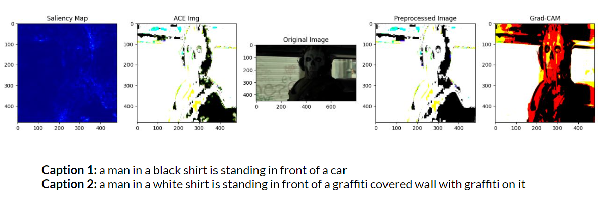
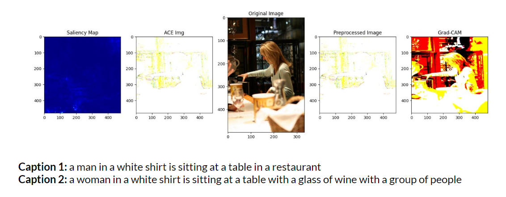
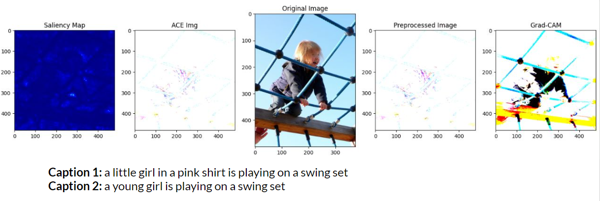

# Explainability for Image Captioning Model

## Introduction
Image Captioning in Deep Learning lacks transparency, making it difficult for users to understand how the model arrived at a particular caption. So, we extend and combine prior CNN explainability approaches (namely ACE, gradCAM and saliency) to the image captioning domain.

Model explainability is a crucial area of research that helps us understand if the model is working correctly or it has learnt something random. However, there's a lack of literature on application of image explainability in Image captioning.

## Usage
The repo contains the code of a flask server that uses webcam to capture image and apply the image captioning model to that image along with the XAI approches and displays the output on the webpage.

First you need to install all requirements using the following code:
```python
pip3 install -r requirements.txt
```

Next you can run the server using:
```python
python3 app.py
```

this runs the flask server. You can now open `localhost:4200` and use the image captioning model and the explainability approaches in the webpage.

## File Structure
```
├── README.md (this file)
├── app.py (main server file)
├── image_classification.ipynb (model experiment notebook)
├── requirements.txt (requirements)
├── source_code
│   ├── Model
│   │   ├── EfficientNetV2L_lstm_model.h5 (efficientNet model)
│   │   ├── *.ipynb (Exp. notebooks)
│   │   ├── vocab.txt (dict file)
│   │   └── vocab_inc.txt (dict file)
│   ├── data
│   │   ├── Download_dataset.txt 
│   │   └── results.csv (dataset)
│   ├── glove6b_model
│   │   └── download_glove.txt
├── static (server files)
│   └── index.css
├── templates (server files)
│   └── index.html
└── vocab.txt (dict)
```


## Image Captioning Model
The Image Captioning model contains a CNN model effecientNetV2 with the last two layers removed, which gives a feature vector. These feature vectors are then fed into a custom LSTM model that uses a dictionary to generate the caption in English

## Explainability approaches
We used the following approaches:
### ACE
Adversarial Attack Technique. The approach involves generating adversarial examples by making small perturbations to the input image, which are then used to train an additional model to generate captions that are similar to the original captions but with improved accuracy.

The classification model used to analyze the adversarial examples can then help to explain how the original image captioning system generated its captions. By analyzing the differences between the original captions and the adversarial examples, the explanation model can highlight which features of the image were most influential in the original image captioning system's decision-making process.
### Grad-CAM
Grad-CAM is a technique used to visualize the areas of an input image that are most important for a deep learning model's prediction. It works by computing the gradients of the output with respect to the feature maps of the last convolutional layer of the model, and then pooling the gradients to obtain a weight map. The weight map is used to generate a class activation map, which highlights the areas of the input image that are most relevant to the model's prediction.
### Saliency Maps
Saliency maps highlight the areas of an input image that are most important for a deep learning model's prediction. They are computed by calculating the gradient of the output with respect to the input image pixels. Saliency maps provide a simple and intuitive way to visualize the features that a model is using to make its prediction, which can help researchers to identify errors and gain insights into how it makes decisions.

## Results




## Authors
- Ananya Agrawal (200117)
- Shivanshu Tyagi (190814)
- Dhruvil Doshi (19817295)
- Shivi Gupta (180730)
- Divya Gupta (200345)
- Amanjit Singh (200107)
